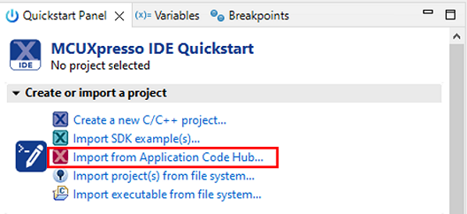
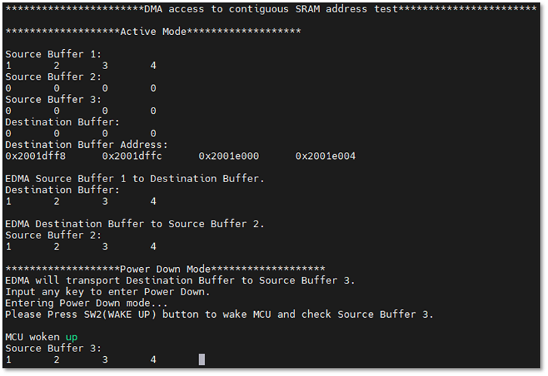

# NXP Application Code Hub

## AN14377: Continuous SRAM address usage on MCXA15x

This software accompanies application note [AN14377], which configures and uses the SRAM X0 Alias to form continuous SRAM address, and validates the feasibility of continuous SRAM address.

#### Boards: FRDM-MCXA156
#### Categories: Memory
#### Peripherals: DMA
#### Toolchains: MCUXpresso IDE, IAR, MDK

## Table of Contents
1. [Software](#step1)
2. [Hardware](#step2)
3. [Setup](#step3)
4. [Results](#step4)
5. [FAQs](#step5) 
6. [Support](#step6)
7. [Release Notes](#step7)

## 1. Software
- [MCUXpresso IDE V11.9.0 or later](https://www.nxp.com/design/software/development-software/mcuxpresso-software-and-tools-/mcuxpresso-integrated-development-environment-ide:MCUXpresso-IDE)
- [IAR 9.50.1](https://www.iar.com/)
- [Keil 5.38](https://www.keil.com/)
- [SDK_2.16.0_FRDM-MCXA156](https://mcuxpresso.nxp.com/en/welcome)

## 2. Hardware
- FRDM-MCXA156 Rev A board:

- One Type-C USB cable.

## 3. Setup
This software support MCUXpresso, IAR, and Keil IDEs at the same time, you can choose the corresponding project according to your needs.

### 3.1 Hardware connection
Use a Type-C USB cable to connect J21 of FRDM-MCXA156 and the USB port of the PC.

### 3.2 MCUXpresso import, build and download the project
1. Open MCUXpresso IDE 11.9.0, in the Quick Start Panel, choose **Import from Application Code Hub**

2. Enter the **demo name** in the search bar.

3. Click **Copy GitHub link**, MCUXpresso IDE will automatically retrieve project attributes, then click **Next>**.

4. Select **main** branch and then click **Next>**, select the MCUXpresso project, click **Finish** button to complete import.

> You need to install the [SDK_2.16.0_FRDM-MCXA156](https://mcuxpresso.nxp.com/en/welcome) on your MCUXpresso IDE.

5. Click **Build** button from the toolbar, then wait for the build to complete.

6. Select the **GUI Flash Tool** from the toolbar to program the executable to the board.

### 3.3 IAR import, build and download the project
1. Clone the project from the following link: https://github.com/nxp-appcodehub/an-continuous-sram-address-mcxa15x.git

2. Open, make and download the project.

### 3.4 Keil import, build and download the project
1. Clone the project from the following link: https://github.com/nxp-appcodehub/an-continuous-sram-address-mcxa15x.git

2. Open, build and download the project.

### 3.5 Validate the feasibility of continuous SRAM address
Open a serial terminal with 115200 baud rate, reset the MCU, then follow the prompts to validate the feasibility of continuous SRAM address.

## 4. Results
As shown below, the corresponding remap bits are enable and the value of the SP register is the end address of SRAM X0 Alias plus one. The above operation is completed before using the stack.

The below figure shows the read and write test for boundary unaligned address.

The below figure shows DMA access to continuous SRAM address test.

## 5. FAQs
No FAQs have been identified for this project.

## 6. Support
*Please contact NXP for additional support.*

#### Project Metadata
<!----- Boards ----->

<!----- Categories ----->

<!----- Peripherals ----->

<!----- Toolchains ----->
  

Questions regarding the content/correctness of this example can be entered as Issues within this GitHub repository.

>**Warning**: For more general technical questions regarding NXP Microcontrollers and the difference in expected funcionality, enter your questions on the [NXP Community Forum](https://community.nxp.com/)

## 7. Release Notes
| Version | Description / Update                           | Date                        |
|:-------:|------------------------------------------------|----------------------------:|
| 1.0     | Initial release on Application Code Hub        | July 5th 2024 |

